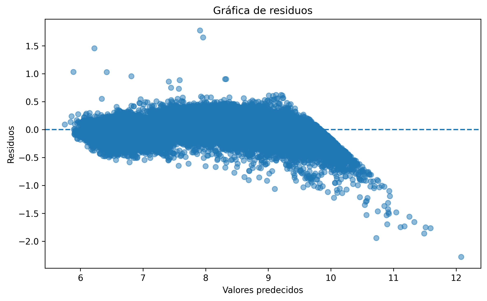
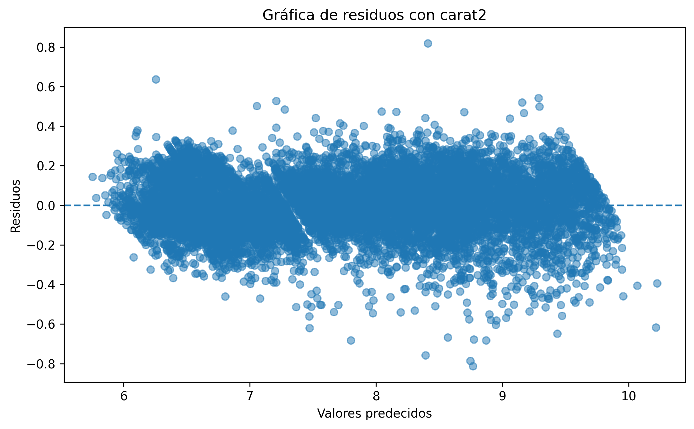
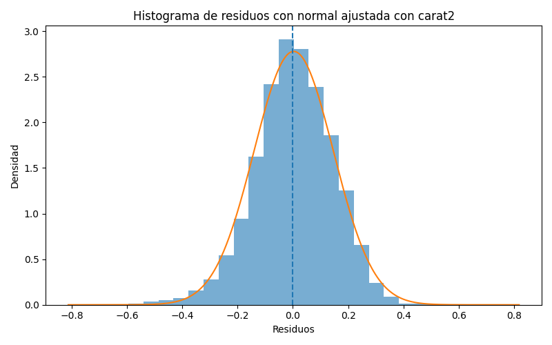
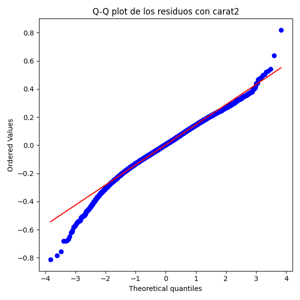
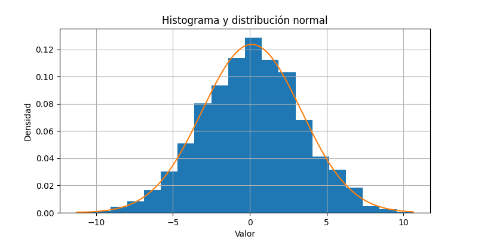
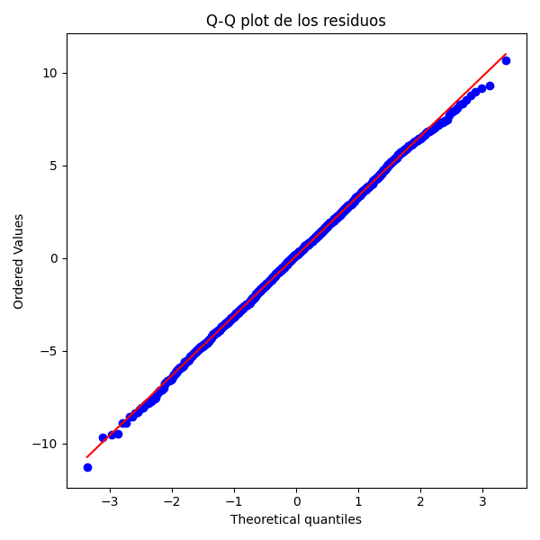

# Respuestas — Práctica Final: Análisis y Modelado de Datos

> Rellena cada pregunta con tu respuesta. Cuando se pida un valor numérico, incluye también una breve explicación de lo que significa.

---

## Ejercicio 1 — Análisis Estadístico Descriptivo
---
Lo primero de todo ha sido simplemente leer el .csv en el que se encontraba el dataset, lo que es muy conveniente porque no hemos tenido que hacer ningún tipo de malabares para cargar los datos, y luego hemos hecho un simple describe de las variables numéricas y las hemos guardado en su propio .csv. También hemos hecho un df.info() para conseguir aún más información no presente en el describe, y luego hemos añadido parte de ella a un dataframe para poder ponerlo en el mismo .csv en el que se encontraba el describe.

Después hemos visto si alguna de las variables dimensionales tenían algún valor nulo, ya que ya hemos visto que no hay ningún NaN, y efectivamente había algunos diamantes con dimensiones nulas. Como eran muy poco diamantes simplemente los hemos quitado. Luego hemos hecho el mismo anñalisis con las variables categóricas para ver si había alguna categoría de más, pero no fue el caso.

Luego hemos calculado distintos estadísticos numéricos (media, mediana, etc...) de las variables numéricas y hemos hecho boxplots de las variables categóricas con respecto al precio, la variable objetivo. También hemos hecho piecharts de las variables categóricas, para ver si había algún desbalanceo, que lo había, pero hemos decidido no tratarlos. 

Por último hemos hecho una matriz de correlación.

---

**Pregunta 1.1** — ¿De qué fuente proviene el dataset y cuál es la variable objetivo (target)? ¿Por qué tiene sentido hacer regresión sobre ella?

> El dataset proviene de una librería de R, que es como la encontré, pero también tiene un GitHub asociado a él. La variable objetivo es el precio de distintos diamantes dadas ciertas características físicas, tanto cuantitativas como cualitativas ordinales. 

> Tiene sentido intentar hacer una regresión lineal sobre esas variables porque uno espera a priori que aumentar el tamaño, por ejemplo, aumente de forma constante el precio del diamante. Luego más adelante veremos que la cuestión no es tan simple y nos veremos obligados a introducir un término no lineal.

**Pregunta 1.2** — ¿Qué distribución tienen las principales variables numéricas y has encontrado outliers? Indica en qué variables y qué has decidido hacer con ellos.

> Es difícil decir si siguen alguna distribución en concreto: algunas están muy concentradas, pero por ejemplo el precio tiene una cola derecha muy larga (he comprobado que no sigue una distribución log-normal). Los outliers están todos en la variable dependiente del precio, que se puede ver claramente cuando hacemos boxplots del precio con respecto a las distintas variables categóricas.

> No hemos decidido hacer nada con esos precios porque son información que consideramos vital, y lo que haremos en el ejercicio 2 será escalarlos para que estén en un rango más razonable.

**Pregunta 1.3** — ¿Qué tres variables numéricas tienen mayor correlación (en valor absoluto) con la variable objetivo? Indica los coeficientes.

> Las variables numéricas con mayor correlación con el precio son el carat (esto es importante que lo tengamos en cuenta para el siguiente ejercicio) y las dimensiones x,y,z. Las correlaciones son carat:precio = 0.92, x:precio = 0.89 y luego hay un empate con y:precio = z:precio = 0.87.

**Pregunta 1.4** — ¿Hay valores nulos en el dataset? ¿Qué porcentaje representan y cómo los has tratado?

> Había algunos valores que tenían alguna de las dimensiones igual a 0, lo que no tiene ningún sentido físico. Eran un porcentaje minúsculo (en x 8 ocurrencias, en y 7 ocurrencias y en z 20 ocurrencias) y simplemente nos hemos deshecho de esas filas. Las variables categóricas no presentaron ningún problema, y en general no hay ningún NaN en el dataset.

---

## Ejercicio 2 — Inferencia con Scikit-Learn

---
En este ejercicio hemos hecho dos modelos. La razón es la siguiente: 

Como podemos ver los residuos empiezan a sesgarse cuando los precios de los diamantes alcanzan un nivel lo suficientemente grande. En cambio los residuos tienen la siguiente forma cuando introducimos un término cuadrático del carat:

No solo eso, si no que podemos comprobar que los residuos siguen una distribución normal alrededor del 0, que es lo que debería ocurrir según nos indica la teoría.

Pero sí es cierto que no es una distribución normal perfecta, como podemos ver en el siguiente Q-Q plot. Antes de enseñarlo, debemos explicar que un Q-Q plot dibuja los percentiles de una distribución dada con las de una distribución normal, y cuando más se acerquen a la recta y = x más normal es la distribución dada. No sé cómo corregir este error, es posible que se deba a que las categorías no estén balanceadas (las de peor calidad son muy pequeñas en número).

---

**Pregunta 2.1** — Indica los valores de MAE, RMSE y R² de la regresión lineal sobre el test set. ¿El modelo funciona bien? ¿Por qué?

> Hemos hecho dos modelos, uno mejor que el otro. El primer modelo fallaba cuando los precios eran muy elevados en una escala logarítmica, con las siguientes métricas: MAE = 0.139, RMSE = 0.179, R^2 = 0.9688

> En cambio en el segundo modelo hemos introducido un término cuadrático del carat y tanto las métricas como el gráfico de residuos mejoraron notablemente: MAE = 0.112, RMSE = 0.144, R^2 = 0.9799

> Por claridad, explicamos que el MAE significa "Mean Absolute Error", y como su nombre indica mide la media del valor absoluto del error que estamos cometiendo con nuestras predicciones. El RMSE significa "Root Mean Squared Error", y es la raíz cuadrada de la media de los errores al cuadrado que estamos cometiendo. Cogemos la raíz cuadrada para preservar las unidades. Por último está el R^2, que es una medida relativa que analiza cuanto mejor son nuestras predicciones en comparación de usar siempre la media para predecir.

---

## Ejercicio 3 — Regresión Lineal Múltiple en NumPy

---
Nada más que comentar más allá de lo que he respondido en las siguientes preguntas.
---

**Pregunta 3.1** — Explica en tus propias palabras qué hace la fórmula β = (XᵀX)⁻¹ Xᵀy y por qué es necesario añadir una columna de unos a la matriz X.

> La columna de unos es porque el intercepto necesita un coeficiente y se lo estamos añadiendo. Lo que hace la fórmula es resolver el problema Xb = y. Primer haces X^tX b = X^t y para que encajen las dimensiones y luego inviertes y pasas todo al otro lado b = (X^t X)^-1 X^t y

**Pregunta 3.2** — Copia aquí los cuatro coeficientes ajustados por tu función y compáralos con los valores de referencia del enunciado.

| Parametro | Valor real | Valor ajustado |
|-----------|-----------|---------------- |
| β₀        | 5.0       | 4.864995        |
| β₁        | 2.0       | 2.063618        |
| β₂        | -1.0      | -1.117038       |
| β₃        | 0.5       | 0.438517        |

> Como podemos ver los valores se ajustan bastante bien a los reales.

**Pregunta 3.3** — ¿Qué valores de MAE, RMSE y R² has obtenido? ¿Se aproximan a los de referencia?

> MAE  : 1.166462, RMSE : 1.461243, R2   : 0.689672
> Todos excepto el R2 se aproximan bastante a los valores de referencia. No estoy seguro de por qué podría ser que el R2 no se acerca lo suficiente, estoy bastante seguro de que el cálculo lo tengo bien hecho.

---

## Ejercicio 4 — Series Temporales
---
Nada más que añadir más allá de lo que he respondido en las preguntas.
---

**Pregunta 4.1** — ¿La serie presenta tendencia? Descríbela brevemente (tipo, dirección, magnitud aproximada).

> La serie presenta una tendencia no lineal al alza que primero parece aplanarse para luego empezar a incrementar a mayor ritmo, recorriendo una altura de 100 unidades a lo largo de la serie.

**Pregunta 4.2** — ¿Hay estacionalidad? Indica el periodo aproximado en días y la amplitud del patrón estacional.

> Efectivamente hay estacionalidad, durante medio año está estable y luego baja en más o menos un cuarto de año para volver a repetir el patrón.

**Pregunta 4.3** — ¿Se aprecian ciclos de largo plazo en la serie? ¿Cómo los diferencias de la tendencia?

> Sí que se aprecian ciclos de largo plazo, ya que el patrón de estacionalidad se repite constantemente a lo largo de la serie. Se diferencian de la tendencia gracias a la descomposición que hemos hecho.

**Pregunta 4.4** — ¿El residuo se ajusta a un ruido ideal? Indica la media, la desviación típica y el resultado del test de normalidad (p-value) para justificar tu respuesta.

> El residuo sí que se ajusta a un ruido ideal, ya que el skewness y el kurtosis son ambos muy cercanos a cero (-0.051 y -0.061 respectivamente) y podemos dibujar los residuos en un histograma y compararlos con una distribución normal. La media es 0.12 y la desviación estándar es 3.2

> También podemos dibujar un Q-Q plot y ver que efectivamente los valores siguen una distribución normal.

---

*Fin del documento de respuestas*
